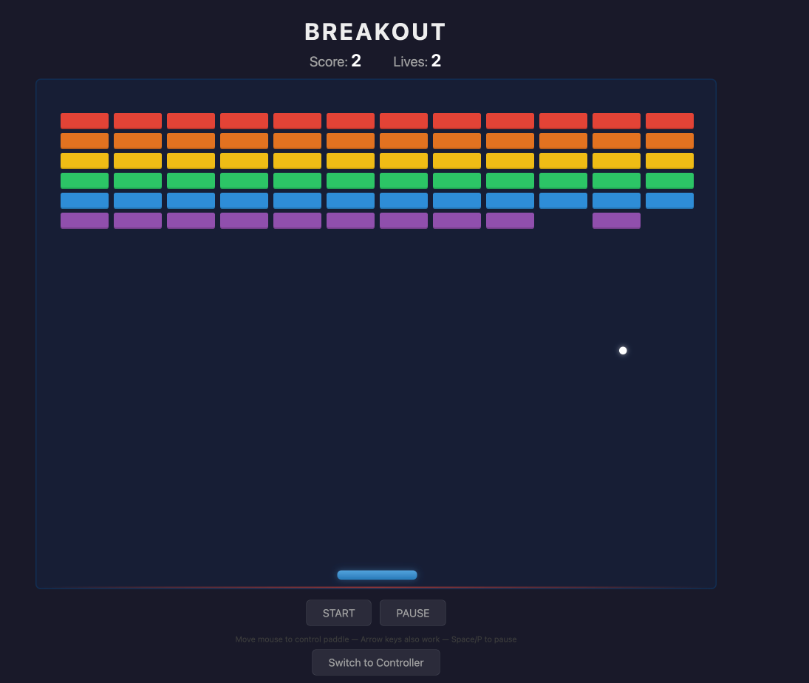
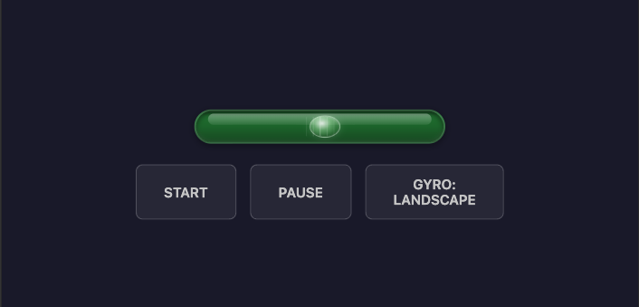

# Breakout

A classic brick-breaking game built with godom. The game runs entirely in Go — the browser is just the display.

The main highlight: **two-screen multiplayer setup**. Open the game on a desktop for the big screen view, and use your phone as a wireless controller — tilt, tap, or slide to move the paddle. The Go server can run on a completely separate third machine. All devices stay in sync over WebSocket.



## Running

```bash
# Local play (opens browser automatically)
go run .

# Two-screen setup: expose to network
GODOM_HOST=0.0.0.0 go run .
```

When `GODOM_HOST=0.0.0.0` is set, the terminal prints a URL with an auth token like:

```
http://192.168.1.10:55123?token=abc123...
```

Open this URL on each device. The token is needed only once — a cookie is set for subsequent visits.

## How it works

- **Desktop/TV** — shows the game area with bricks, ball, and paddle. Move the mouse or use arrow keys to control the paddle. Space or P to pause.
- **Phone (controller)** — automatically switches to controller mode on narrow screens (< 700px). Shows score, lives, d-pad buttons, and start/pause/gyro controls.
- **State sync** — godom syncs state across all connected browsers. Moving the paddle on the phone moves it on the desktop in real time. There's no "pairing" step — every connected tab sees and controls the same game.

### Controls

| Input | Where | How |
|---|---|---|
| Mouse | Desktop | Move mouse over game area |
| Arrow keys | Desktop | Left/Right to move paddle |
| D-pad buttons | Phone (portrait) | Tap and hold — accelerates |
| Gyroscope (portrait) | Phone | Tilt phone left/right |
| Gyroscope (landscape) | Phone | Hold phone sideways, tilt wrists |
| Touch slider | Phone (landscape) | Drag the bubble on the spirit level bar |
| Space / P | Desktop | Pause/unpause |

### Gyroscope modes

The GYRO button cycles through three modes:

1. **OFF** — d-pad buttons only
2. **PORTRAIT** — phone upright, tilt left/right (gamma axis, ±45°)
3. **LANDSCAPE** — phone on its side, tilt wrists (beta axis, ±20°). The UI rotates to match, and a spirit-level bubble bar appears for touch control.



### Sound & vibration

When a controller (phone) is connected, sound effects play **only on the controller** — the game screen stays silent. If no controller is connected, sounds play on the game view instead. This is detected automatically via a synced flag:

- Brick hit, paddle bounce, wall bounce — short tones
- Life lost — descending notes + vibration
- Game over — longer descending sequence + strong vibration
- Win — ascending fanfare + short vibration

Sounds use the Web Audio API (no audio files). Vibration uses the Vibration API where supported.

## Browser limitations

### Gyroscope requires secure context

Mobile browsers restrict `DeviceOrientationEvent` to secure contexts (HTTPS or localhost). When the Go server runs on a different machine, the phone connects via plain HTTP to a LAN IP, which browsers treat as insecure.

**Workaround for Chrome on Android:**

1. Open `chrome://flags` on the phone
2. Search for **"Insecure origins treated as secure"**
3. Add the server URL (e.g., `http://192.168.1.10:55123`)
4. Relaunch Chrome

**iOS Safari:** Gyroscope also requires a user gesture to activate. The game handles this automatically — the permission prompt appears on first touch.

### AudioContext autoplay policy

Browsers suspend audio until the user interacts with the page. The game pre-warms the audio context on the first button click (e.g., START), so sounds work from the first game event onward.

## What runs where

Most godom apps need zero JavaScript. This example uses more JS than usual because it taps into browser-only APIs that have no Go equivalent:

**Go (server) handles:**
- Game loop (60fps ticker), ball physics, collision detection
- All game state — score, lives, brick grid, paddle position, ball trajectory
- Input processing — mouse coordinates, d-pad steering, gyroscope tilt values
- Multi-device sync — every connected browser sees the same state automatically

**JavaScript (browser) handles:**
- **Gyroscope** (`gyro.js`) — reads `DeviceOrientationEvent` and sends tilt angles back to Go via a hidden `<input g-bind>` element. This API only exists in the browser.
- **Sound effects** (`sfx.js`) — generates tones with the Web Audio API and triggers vibration. Go sets a `SoundEvent` field; JS watches for changes via MutationObserver and plays the matching sound. Controller tabs announce their presence via a synced flag so game-view tabs know to stay silent. Audio synthesis can only run in the browser.
- **Rendering** — CSS handles all visuals (positioning, scaling, animations, the spirit-level bubble). No canvas or WebGL — just styled `<div>` elements driven by godom's VDOM.

The JS files are injected as godom plugins (`eng.RegisterPlugin`), not inline `<script>` tags. The game logic, state, and control flow remain entirely in Go.

## Architecture

```
┌──────────────┐         WebSocket          ┌──────────────┐
│  Desktop     │◄──────────────────────────► │   Go server  │
│  (game view) │                            │  (game loop  │
└──────────────┘         WebSocket          │   + state)   │
┌──────────────┐◄──────────────────────────► │              │
│  Phone       │                            └──────────────┘
│  (controller)│          All three can be
└──────────────┘          separate machines
```

- `main.go` — game loop, physics, collision detection, state management
- `ui/index.html` — game view + controller view, responsive CSS, auto-scaling canvas
- `gyro.js` — gyroscope bridge (browser → Go via hidden `<input g-bind>`)
- `sfx.js` — sound effects + vibration (Go → browser via MutationObserver on hidden `<span g-text>`)

No framework modifications were needed — the game uses godom's standard directives, plugin system, and multi-tab state sync.
